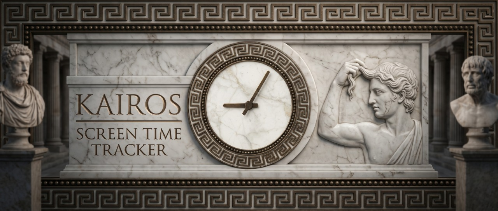
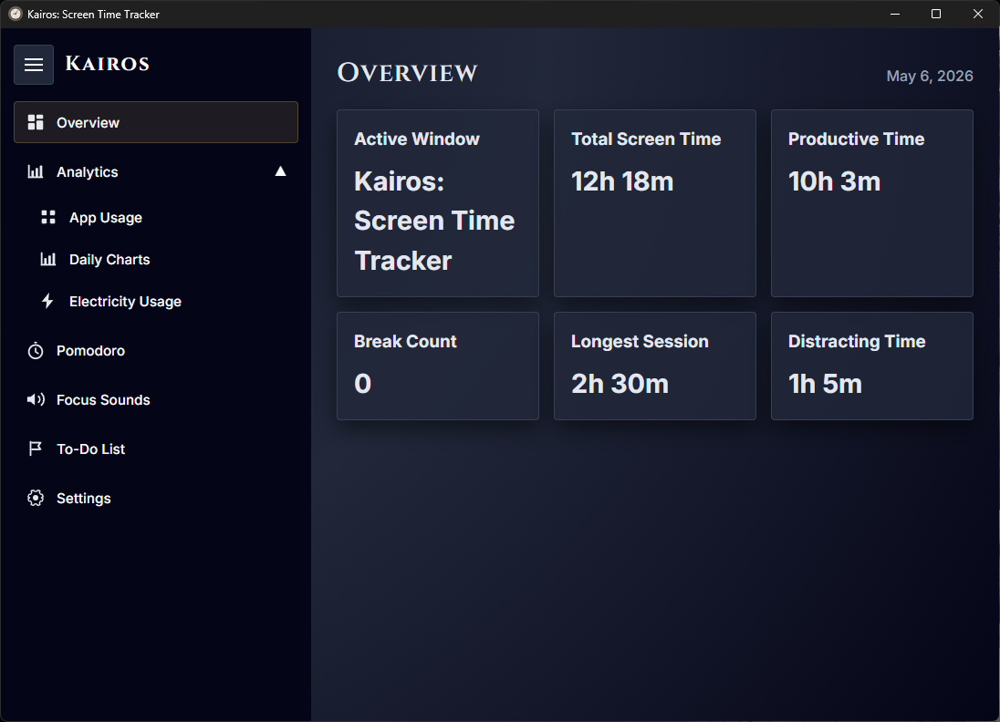
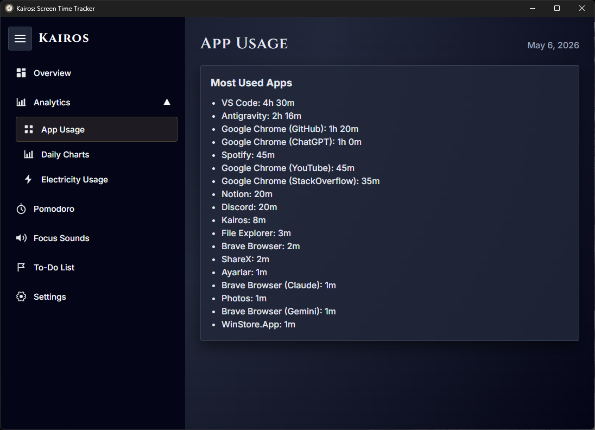
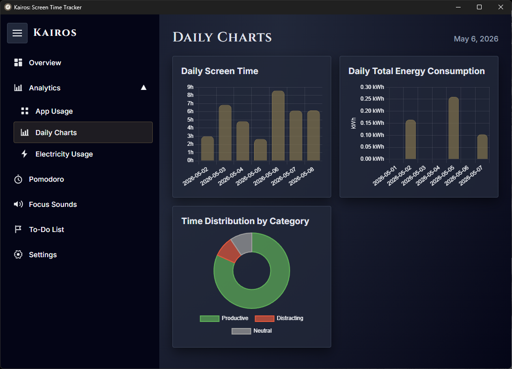
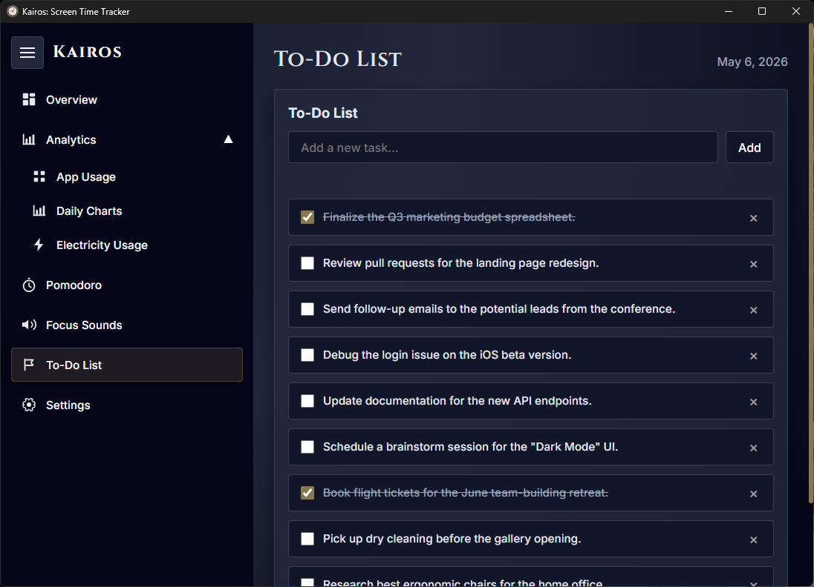

[English](README.md) | [Türkçe](README.tr.md)

<div align="center">
  
</div>

# Kairos: Ekran Süresi İzleyici

**Zamanınızın nereye gittiğini bilin. Kontrolü geri kazanın.**

[](https://github.com/osklc/kairos/releases)
[](https://github.com/osklc/kairos/releases)
[](https://tauri.app)
[](https://www.rust-lang.org)
[](LICENSE)

[**⬇ Windows için İndir**](https://github.com/osklc/kairos/releases/download/v0.1.0/Kairos_0.1.0_x64_en-US.msi)  ·  [Releases](https://github.com/osklc/kairos/releases)  ·  [Report Bug](https://github.com/osklc/kairos/issues)

---

## İçindekiler

- [Kairos Nedir?](#kairos-nedir)
- [✨ Özellikler](#-özellikler)
- [📸 Ekran Görüntüleri](#-ekran-görüntüleri)
  - [🏠 Genel Bakış](#-genel-bakış)
  - [🔔 Akıllı Uygulama Sınıflandırması](#-akıllı-uygulama-sınıflandırması)
  - [📱 Uygulama Kullanımı](#-uygulama-kullanımı)
  - [📊 Günlük Grafikler](#-günlük-grafiler)
  - [⚡ Elektrik Tüketimi](#-elektrik-tüketimi)
  - [🍅 Pomodoro Zamanlayıcı](#-pomodoro-zamanlayıcı)
  - [🎵 Odak Sesleri](#-odak-sesleri)
  - [✅ Yapılacaklar Listesi](#-yapılacaklar-listesi)
  - [🎨 Temalar](#-temalar)
- [🎬 Demo Video](#-demo-video)
- [🏗️ Mimari](#-mimari)
  - [Temel Tasarım Kararları](#temel-tasarım-kararları)
  - [Teknoloji Yığını](#teknoloji-yığını)
- [⚙️ Kurulum](#-kurulum)
  - [Seçenek 1 — Kurulumcuyu İndir (Önerilen)](#seçenek-1---kurulumcuyu-indir-önerilen)
  - [Seçenek 2 — Kodu Derle](#seçenek-2---kodu-derle)
- [🛠️ Yapılandırma](#-yapılandırma)
- [🗺️ Yol Haritası](#-yol-haritası)
- [🤝 Katkıda Bulunma](#-katkıda-bulunma)
- [📄 Lisans](#-lisans)

---

## Kairos Nedir?

Kairos, **hafif, gizlilik odaklı bir ekran süresi izleyicisidir** Windows için ve sistem tepsisinde sessizce çalışır. Gün içinde hangi uygulamalara, web sitelerine ve kategorilere ne kadar zaman harcadığınızı gösterir.

Bulut tabanlı rakiplerin aksine, **tüm veriler yerel SQLite veritabanında kalır**. Abonelik, hesap ya da telemetri yoktur. Kairos ayrıca **Pomodoro zamanlayıcı**, **odak sesleri**, **yapılacaklar listesi** ve **canlı enerji tüketim monitörü** ile ekran süresi bilgilerinin çevresel ve finansal etkisini de gösterir.

---

## ✨ Özellikler

| Özellik | Açıklama |
|---|---|
| 🪟 **Otomatik Uygulama Takibi** | Aktif pencereyi her saniye sessizce algılar — manuel giriş gerekmez |
| 🧠 **Akıllı Sınıflandırma** | Uygulamaları Üretken, Nötr veya Dikkat Dağıtıcı olarak otomatik kategorize eder |
| 🌐 **Tarayıcı Düzeyinde Ayrıntı** | `Chrome (GitHub)` ile `Chrome (YouTube Dikkat Dağıtıcı)` arasını ayırır |
| ⚡ **Canlı Elektrik Monitörü** | GPU/CPU sensörlerinden veya batarya telemetriden gerçek zamanlı watt tüketimi |
| 📊 **Günlük Grafikler** | 7‑günlük çubuk grafik, enerji tüketim grafiği ve kategori pasta grafiği |
| 🍅 **Pomodoro Zamanlayıcı** | Animasyonlu daire, yapılandırılabilir aralıklar ve ara dinlenme takibi |
| 🎵 **Odak Sesleri** | Yağmur, orman, beyaz gürültü gibi ortam sesleri ve canlı ses görselleştirici |
| ✅ **Yapılacaklar Listesi** | İstatistiklerin yanına kalıcı bir görev listesi |
| 🎨 **7 Tema** | Hegemon Classic, Black, Midnight, Nord, Cyberpunk, Rose Pine, Forest |
| 🌍 **Çok Dilli** | Tam İngilizce ve Türkçe arayüz |
| 🚀 **Başlangıçta Çalıştır** | Opsiyonel otomatik başlatma — her zaman izleme, her zaman arka planda |
| 🔒 **%100 Yerel** | Veri hiç buluta gitmez |

---

## 📸 Ekran Görüntüleri

### 🏠 Genel Bakış
> Anlık olarak: aktif pencere, toplam ekran süresi, üretken vs dikkati dağıtıcı oranı, kesinti sayısı ve en uzun oturum.



---

### 🔔 Akıllı Uygulama Sınıflandırması
> Kairos bilinmeyen bir uygulamayı ilk gördüğünde sizi sınıflandırma yapmaya yönlendirir. Seçiminiz kalıcıdır ve sonraki oturumlarda uygulanır.

<video src="https://github.com/user-attachments/assets/1cb44252-4027-4bbb-abe2-e036ccc4b828" controls muted loop autoplay style="max-width: 100%; height: auto;"/>

---

### 📱 Uygulama Kullanımı
> Gün içinde kullanılan her uygulamanın listesi, harcanan süre ve renk kodlu kategori etiketi.



---

### 📊 Günlük Grafikler
> Üç grafik bir arada: 7‑günlük çubuk ekran süresi, günlük enerji tüketimi ve bugünün üretken/dikkat dağıtıcı/nötr zaman dağılımı.



---

### ⚡ Elektrik Tüketimi
> Sistem güç tüketimi her 10 saniyede güncellenir. Kairos en doğru kaynağı seçer — laptoplarda batarya, masaüstlerinde NVML/ADL vb.

<video src="https://github.com/user-attachments/assets/b56aa050-e2e9-4450-bceb-989fe5a1b160" controls muted loop autoplay style="max-width: 100%; height: auto;"/>

---

### 🍅 Pomodoro Zamanlayıcı
> Dairesel geri sayım, otomatik odak → kısa molalar → uzun molalar döngüsü. Tamamlanan oturumlar ve toplam odak süresi otomatik kaydedilir.

<video src="https://github.com/user-attachments/assets/6214010d-d962-4443-aad0-7a0174c980dd" controls muted loop autoplay style="max-width: 100%; height: auto;"/>

---

### 🎵 Odak Sesleri
> Üç katmanlı ortam sesleri — **Pluvia** (yağmur), **Silva** (orman), **Focus Static** (beyaz gürültü) — bağımsız ses kontrolü ve canlı kanvas ses görselleştirici.

<video src="https://github.com/user-attachments/assets/07b5f763-4c62-453d-93ca-83487076392c" controls loop autoplay style="max-width: 100%; height: auto;"/>

---

### ✅ Yapılacaklar Listesi
> Görevlerinizi yerel olarak saklayan yerleşik bir liste ile gününüzü düzenleyin.



---

### 🎨 Temalar
> 7 el yapımı tema arasında anında geçiş yapın. Seçiminiz yeniden başlatmalarda kalır.

<video src="https://github.com/user-attachments/assets/7fc48e66-c60b-4fa8-942e-74cebece5c0a" controls muted loop autoplay style="max-width: 100%; height: auto;"/>

---

## 🎬 Demo Video
> *(Yakında — tüm özelliklerin 3 dakikalık bir tanıtımı)*

[](https://github.com/osklc/kairos/releases)

---

## 🏗️ Mimari

Kairos bir **Tauri 2** uygulamasıdır: Rust backend'i vanilla JS frontend'e sıfır gecikmeli IPC köprüsüyle sunar. Tek bir yerel ikili dosya ve gömülü WebView ile çalışır — Electron ya da Node.js yok.

```text
┌─────────────────────────────────────────────────────────┐
│                    Frontend (WebView)                   │
│  HTML · Vanilla CSS · Vanilla JS · Chart.js · i18n.json │
└────────────────────┬───────────────────────────┬────────┘
                      │ invoke()                  │ listen()
                      ▼                           ▼
┌─────────────────────────────────────────────────────────┐
│                   Tauri IPC Layer                       │
└───────────────────┬─────────────────────────────────────┘
                     │
┌───────────────────▼─────────────────────────────────────┐
│                   Rust Backend                          │
│                                                         │
│  ┌──────────────────┐   ┌──────────────────────────┐    │
│  │  Window Tracker  │   │   Power Monitor Thread   │    │
│  │  Thread (1s poll)│   │   (10s poll)             │    │
│  │                  │   │                          │    │
│  │ active_win_pos_rs│   │ NVML (NVIDIA)            │
│  │ normalize_app()  │   │ ADL2 / WMI (AMD)         │
│  │ auto-categorise  │   │ Battery sensor (laptop) │
│  │                  │   │ CPU estimation (fallback)│
│  └────────┬─────────┘   └───────────┬──────────────┘    │
│           │ emit events             │ emit events       │
│           │ write sessions          │                   │
│           ▼                         ▼                   │
│  ┌──────────────────────────────────────────────────┐   │
│  │           SQLite Database (rusqlite bundled)     │   │
│  │  sessions · app_categories · settings            │   │
│  └──────────────────────────────────────────────────┘   │
└─────────────────────────────────────────────────────────┘
```

### Temel Tasarım Kararları

- **≥5 s aralıklarla oturum flush** — izleyici her tick’te `UPDATE sessions SET end_time = now` çalıştırır, böylece kategori değişiklikleri anında grafiklerde yansır.
- **YouTube zekası** — YouTube sekmeleri başlık anahtar kelimelerine göre sınıflandırılır. Eğitim (`tutorial`, `lecture`…) → Üretken; eğlence (`shorts`, `gameplay`…) → Dikkat Dağıtıcı; belirsiz içerik 2 dk sonrası gözden geçirilir.
- **Enerji kaynağı önceliği** — batarya → NVML (NVIDIA) → ADL2 (AMD) → LibreHardwareMonitor WMI → WMI GPU kullanım → CPU % × TDP tahmini + 30 W temel tüketim. Buffer aşırı ani dalgalanmaları yumuşatır.
- **Kapatma davranışı** — `CloseRequested` olayı yakalanır, pencere gizlenir, çıkmaz; izleme her zaman devam eder.

### Teknoloji Yığını

| Katman | Teknoloji |
|---|---|
| Uygulama çerçevesi | [Tauri 2](https://tauri.app) |
| Backend dili | Rust (edition 2021) |
| Veritabanı | SQLite via `rusqlite` (bundled) |
| Pencere tespiti | `active-win-pos-rs` |
| Sistem bilgisi | `sysinfo` |
| Batarya | `battery` |
| NVIDIA GPU | `nvml-wrapper` |
| AMD GPU | `libloading` (ADL2 / `atiadlxx.dll`), `wmi` |
| Async runtime | `tokio` |
| Frontend grafik | [Chart.js](https://www.chartjs.org) |
| Fontlar | [Cinzel](https://fonts.google.com/specimen/Cinzel) + [Inter](https://fonts.google.com/specimen/Inter) |

---

## ⚙️ Kurulum

### Seçenek 1 — Kurulumcuyu İndir (Önerilen)

1. [**Releases**](https://github.com/osklc/kairos/releases/latest) sayfasına gidin.
2. `Kairos_x.x.x_x64-setup.exe` dosyasını indirin.
3. Kurucuyu çalıştırın — Windows SmartScreen, imzasız olduğundan uyarabilir; **Daha fazla bilgi → Yine de çalıştır** tıklayın.
4. Kairos anında izlemeye başlar ve sistem tepsinizde görünür.

> **[⬇ En son sürümü indir](https://github.com/osklc/kairos/releases/download/v0.1.0/Kairos_0.1.0_x64_en-US.msi)**

---

### Seçenek 2 — Kodu Derle

#### Gereksinimler

| Araç | Versiyon | Kurulum |
|---|---|---|
| Rust | ≥ 1.78 | [rustup.rs](https://rustup.rs) |
| Node.js | ≥ 18 | [nodejs.org](https://nodejs.org) |
| WebView2 | latest | Windows 11 önceden kurulu; Win 10 için [indirin](https://developer.microsoft.com/en-us/microsoft-edge/webview2/) |

#### Adımlar

```powershell
# 1. Depoyu klonla
git clone https://github.com/osklc/kairos.git
cd kairos

# 2. Tauri CLI kur
npm install

# 3. Geliştirme modunda çalıştır (hot‑reload)
npm run tauri dev

# 4. Üretim kurulum paketini oluştur
npm run tauri build
# Çıktı: src-tauri/target/release/bundle/nsis/Kairos_x.x.x_x64-setup.exe
```

> **Not:** İlk derlemede Cargo ~200 crate derleyecek; 5‑10 dk sürebilir. Sonraki derlemeler artımlı olur.

#### AMD GPU Güç Okuması (opsiyonel)

Kairos **ADL2** arayüzü (`atiadlxx.dll`) üzerinden AMD GPU gücünü okur. Radeon Software yüklü değilse, WMI‑tabanlı GPU kullanım tahmini devreye girer — manuel yapılandırma gerekmez.

---

## 🛠️ Yapılandırma

Tüm ayarlar uygulamanın veri dizininde saklanır:

```
%APPDATA%\\com.osman.kairos\\
  tracker.db       ← SQLite veritabanı (oturumlar, kategoriler, ayarlar)
```

Uygulama içindeki **Ayarlar** sayfasından yönetilir:

| Ayar | Açıklama |
|---|---|
| **Tema** | 7 yerleşik temadan seçim |
| **Dil** | English / Turkish |
| **Başlangıçta Çalıştır** | `tauri-plugin-autostart` ile Windows autostart’a kaydet |
| **Kategori İstemlerini Devre Dışı Bırak** | "Yeni Uygulama Algılandı" modalını gizle |
| **Uygulamaları Kategorize Et** | Takip edilen herhangi bir uygulamanın kategorisini manuel olarak değiştir |

---

## 🗺️ Yol Haritası

- [ ] Haftalık ve aylık özet raporlar
- [ ] CSV / JSON veri dışa aktarımı
- [ ] Günlük ekran süresi hedefi ve hatırlatmalar
- [ ] Uygulama zaman limitleri ve yumuşak uyarılar
- [ ] macOS ve Linux desteği
- [ ] Özel kategori kuralları için Plugin API

---

## 🤝 Katkıda Bulunma

Pull request’ler memnuniyetle karşılanır. Büyük değişiklikler öncesinde bir issue açarak neyi değiştirmek istediğinizi tartışın.

1. Depoyu fork’layın
2. Özellik dalı oluşturun (`git checkout -b feature/harika-özellik`)
3. Değişiklikleri commit edin (`git commit -m 'feat: harika özellik eklendi'`)
4. Dalı pushlayın (`git push origin feature/harika-özellik`)
5. Pull Request açın

---

## 📄 Lisans

Kairos ücretsiz bir yazılımdır: **GNU General Public License v3.0** altında yeniden dağıtabilir ve/veya değiştirebilirsiniz.

[LICENSE](LICENSE) dosyasına bakın.

---

<div align="center">
  Made with ☕ and Rust  ·  © 2026 osklc
</div>
